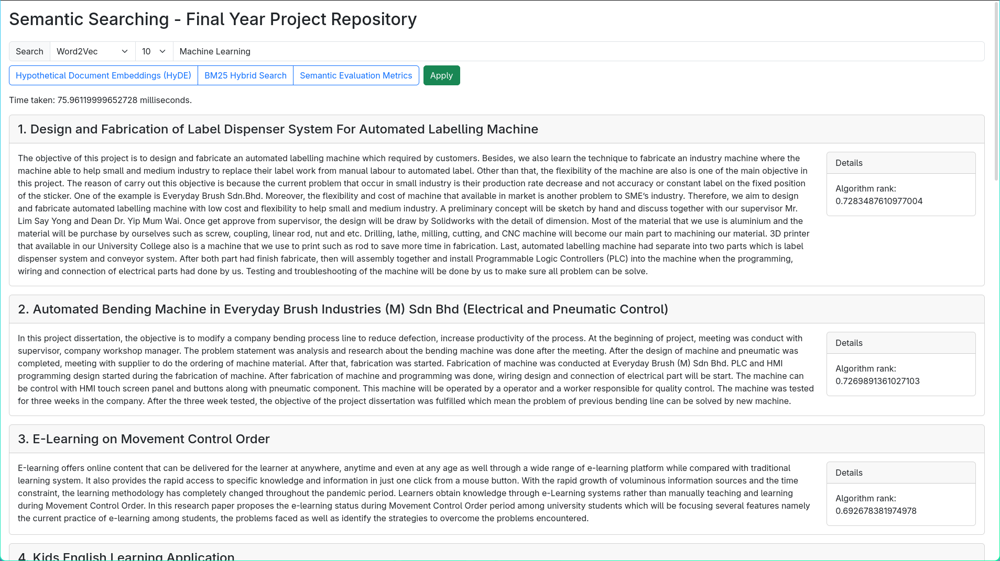

Semantic Searching
==================

A practice, demonstration, and comparison of semantic searching implemented 
in multiple methods.

<sub>Assigment for an Artificial Intelligence course



## Methods

1. Word2Vec
2. Sentence BERT
3. Large Language Model (LLM)

## Setup

```shell
uv run --group build ./scripts/download_data.py --dataset-dir ./data --model-dir ./models
```

## Running

```shell
uv run fastapi run
```

## Evaluation

```shell
uv run ./scripts/evaluate.py -i ./data/50-fyp.csv -n 20 -o results.txt
```